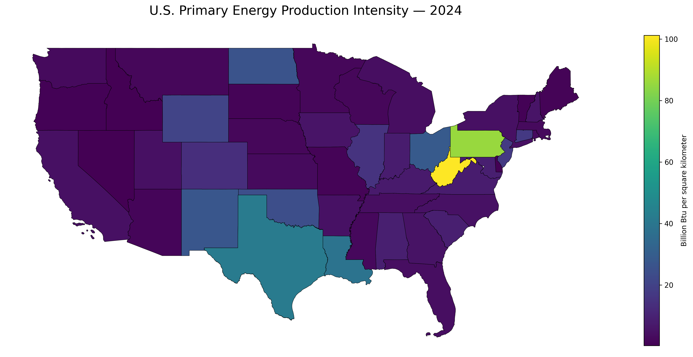

# U.S. State Energy Analytics — Executive Project Brief

## Executive Summary

This project combines public energy and geographic data to create a state-level analytical view of U.S. energy production, consumption, and geographic production intensity from **2014 through 2024**.

The analysis integrates the U.S. Energy Information Administration (EIA) State Energy Data System with U.S. Census state boundaries. The resulting dataset supports both conventional state comparisons and spatially normalized measures that provide a different perspective from absolute energy totals alone.

The current analytical dataset contains:

- **518,872** annual energy observations
- **962** distinct EIA energy series
- **54** EIA geographic identifiers
- **11 years** of annual history
- **51** state/state-equivalent geographies with Census geometry

## Analytical Questions

The project currently focuses on two questions:

1. **Where is U.S. primary energy production most geographically concentrated?**
2. **Which states produce more primary energy than they consume?**

These questions illustrate why absolute totals and normalized measures should be viewed together.

## 1. Primary Energy Production Intensity

Total primary energy production alone naturally favors large producing states. To add geographic context, the analysis normalizes EIA primary energy production by Census land area:

```text
Production intensity
=
Total primary energy production (Billion Btu)
÷
Land area (km²)
```

### 2024 result

Texas was the largest state by **absolute primary energy production**, but West Virginia had the highest **production intensity per square kilometer**.

| Rank | State | Primary Energy Production Intensity (Billion Btu/km²) |
|---:|---|---:|
| 1 | West Virginia | 101.21 |
| 2 | Pennsylvania | 85.53 |
| 3 | Texas | 41.81 |
| 4 | Louisiana | 38.58 |
| 5 | Ohio | 28.46 |

This distinction matters analytically: total production measures scale, while production intensity highlights the spatial concentration of energy activity.

## Geographic View



The map shows a clear concentration of high production intensity in parts of Appalachia and major producing states in the South and Mountain West.

## 2. Production-Consumption Balance

The second analysis compares two EIA measures with the same unit:

- **TEPRB** — Total primary energy production, Billion Btu
- **TETCB** — Total energy consumption, Billion Btu

For each state and year:

```text
Production-consumption balance
=
Primary energy production
-
Total energy consumption
```

States are then classified as:

- **Net Producer** — production exceeds consumption
- **Net Consumer** — consumption exceeds production

### 2024 result

Across the 51 mapped state/state-equivalent geographies:

- **12** were net producers
- **39** were net consumers

### Largest positive balances

| State | Production (Billion Btu) | Consumption (Billion Btu) | Balance (Billion Btu) | Production / Consumption |
|---|---:|---:|---:|---:|
| Texas | 28,288,241 | 14,536,890 | 13,751,351 | 1.95× |
| New Mexico | 8,522,809 | 684,005 | 7,838,804 | 12.46× |
| Pennsylvania | 9,911,312 | 3,612,264 | 6,299,048 | 2.74× |
| West Virginia | 6,301,950 | 835,433 | 5,466,517 | 7.54× |
| Wyoming | 5,195,486 | 507,065 | 4,688,421 | 10.25× |

### Largest negative balances

| State | Production-Consumption Balance (Billion Btu) |
|---|---:|
| California | -5,146,744 |
| Florida | -3,816,797 |
| New York | -2,876,366 |
| Georgia | -2,184,198 |
| Michigan | -1,959,277 |

### Interpretation

The balance provides a simple way to distinguish production-oriented and consumption-oriented state energy profiles.

It should **not** be interpreted as a direct measure of interstate energy exports or imports. Physical energy flows, transformation losses, imports, exports, and fuel-specific market structures would require additional datasets and reconciliation.

## Data Quality Consideration: Geography

The EIA dataset contains 54 geographic identifiers, but three do not represent Census state polygons:

- `US` — United States aggregate
- `X3` — Federal Offshore - Gulf of America
- `X5` — Federal Offshore - Pacific

Rather than removing these records, the data model retains them and flags which geographies can be spatially mapped. This allows non-spatial national/offshore observations to remain available while preventing inappropriate geographic joins.

## Why the Analytical Model Matters

The EIA SEDS source contains hundreds of series across different units, including energy, prices, expenditures, physical volumes, electricity measures, and emissions.

A numerical `value` cannot be interpreted independently of its series and unit. The analytical model therefore preserves energy-series definitions separately from observations so comparisons are made only across compatible measures.

For example, primary production and total consumption can be compared because both selected series are measured in **Billion Btu**. By contrast, energy values should not be aggregated indiscriminately with barrels, dollars, percentages, or CO2 emissions.

## Methodology

The analysis follows four main stages:

1. **Acquire** annual EIA SEDS observations for 2014–2024.
2. **Standardize** geography, series metadata, year, and numerical values.
3. **Enrich** mappable state records with official Census TIGER/Line boundaries and land area.
4. **Analyze** absolute production, production intensity, and production-consumption balance.

The underlying implementation uses PostgreSQL/PostGIS and dbt so that the analytical definitions remain reproducible and testable rather than existing only inside a notebook.

## Current Analytical Opportunities

The same foundation can support additional questions without redesigning the base dataset, including:

- How has each state's production-consumption balance changed since 2014?
- Which states have shifted most toward renewable energy production?
- How does energy-related CO2 intensity differ across states?
- Which states combine high production with comparatively low emissions intensity?
- How do energy profiles cluster geographically or regionally?

## Key Takeaway

The project demonstrates that **scale, geography, and energy balance can tell different stories about the same state**.

Texas dominates absolute primary energy production, while West Virginia leads after adjusting for land area. At the same time, only 12 of 51 mapped geographies produced more primary energy than they consumed in 2024.

The main analytical value is not a single ranking; it is a reusable state-energy model that makes those comparisons consistent, transparent, and extensible.
