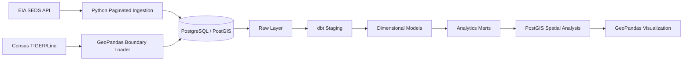

# U.S. State Energy Data Platform

A reproducible ELT and geospatial analytics platform for U.S. state-level energy data, built with **Python, PostgreSQL/PostGIS, dbt, Docker, and GeoPandas**.

The platform ingests annual data from the U.S. Energy Information Administration (EIA) State Energy Data System (SEDS), preserves the source in a raw layer, models it into tested analytical structures with dbt, enriches valid state geographies with U.S. Census TIGER/Line boundaries, and produces spatial and production-versus-consumption analytics.

## Project Overview

Energy datasets are often challenging to model because a single source can contain hundreds of measures, multiple units, geographic aggregates, and historical observations. This project addresses those problems by separating ingestion, transformation, dimensional modeling, spatial enrichment, and analytics into clear layers.

**Current source profile**

- **518,872** annual EIA observations
- **962** distinct energy series
- **54** EIA geographic identifiers
- **2014–2024** annual history
- **51** geographies mapped to Census state/equivalent boundaries

## Architecture



### Data flow

```text
EIA SEDS API                Census TIGER/Line
     │                             │
     ▼                             ▼
Python pagination              GeoPandas
     │                             │
     └──────────────┬──────────────┘
                    ▼
             PostgreSQL/PostGIS
                    │
             ┌──────┴──────┐
             ▼             ▼
      raw.eia_seds   raw.us_state_boundaries
             │             │
             └──────┬──────┘
                    ▼
                  dbt
                    │
             staging models
                    │
          ┌─────────┴─────────┐
          ▼                   ▼
     dim_state        dim_energy_series
          └─────────┬─────────┘
                    ▼
            fact_state_energy
                    │
          ┌─────────┴─────────┐
          ▼                   ▼
 production mart       energy balance mart
          │
          ▼
      PostGIS / GeoPandas
```

## Technology Stack

| Layer | Technology | Purpose |
|---|---|---|
| Ingestion | Python, Requests | Paginated extraction from the EIA API |
| Database | PostgreSQL | Persistent analytical storage |
| Spatial database | PostGIS | Geometry storage and spatial SQL |
| Transformation | dbt | SQL modeling, lineage, and data tests |
| Geospatial processing | GeoPandas, Shapely | Census boundary ingestion and map generation |
| Runtime | Docker Compose | Reproducible local database environment |
| Visualization | Matplotlib / GeoPandas | State-level choropleth output |

## Data Sources

### EIA State Energy Data System (SEDS)

Annual state-level energy production, consumption, price, expenditure, and emissions measures are ingested from the EIA SEDS API for 2014–2024.

The API is paginated in **5,000-row batches** and loaded page-by-page into PostgreSQL rather than accumulating the entire source in memory before persistence.

### U.S. Census TIGER/Line

State and state-equivalent boundaries are loaded as PostGIS geometry and used to spatially enrich EIA state records. Census-provided land area is retained for geographic normalization.

## Data Model

The analytical warehouse separates descriptive entities from measurements.

### `analytics.dim_state`

One record per EIA geographic entity, including:

- EIA state/geography identifier
- state name
- Census FIPS code where available
- land and water area
- PostGIS geometry
- `is_mappable` flag

### `analytics.dim_energy_series`

One record per EIA SEDS series, including:

- series identifier
- series description
- measurement unit

This is important because EIA values are not universally additive. The source includes measures such as Billion Btu, barrels, dollars, percentages, electricity quantities, and CO2 emissions.

### `analytics.fact_state_energy`

Annual energy observations at the grain:

> **one geography + one energy series + one year**

The fact table contains warehouse keys, year, numerical value, and ingestion metadata while descriptive attributes remain in dimensions.

## Geographic Modeling

The EIA source contains **54 geographic identifiers**, but not every identifier represents a physical state boundary.

Three identifiers do not map directly to Census state/equivalent polygons:

| EIA ID | Description |
|---|---|
| `US` | United States aggregate |
| `X3` | Federal Offshore - Gulf of America |
| `X5` | Federal Offshore - Pacific |

These records are **preserved** in the raw and warehouse layers rather than removed. Spatial marts use the `is_mappable` attribute to include only entities with a reliable Census geometry.

This keeps source fidelity separate from downstream analytical requirements.

## Analytics Marts

### State Energy Production

`analytics.mart_state_energy_production` combines total primary energy production (`TEPRB`) with state geography and Census land area.

A normalized production-intensity measure is calculated as:

```text
production intensity = total primary energy production / land area (km²)
```

This distinguishes **absolute production** from **geographic concentration of production**.

### State Energy Balance

`analytics.mart_state_energy_balance` compares:

- `TEPRB` — Total primary energy production, Billion Btu
- `TETCB` — Total energy consumption, Billion Btu

The analytical balance is:

```text
energy balance = production - consumption
```

A positive value is classified as **Net Producer** and a negative value as **Net Consumer**.

> This is a production-consumption balance, not a direct measure of physical interstate energy exports or imports.

## Selected 2024 Findings

### Production intensity

Absolute production and production intensity provide different views of the U.S. energy landscape.

- **Texas** had the highest total primary energy production.
- **West Virginia** had the highest production per square kilometer.
- **Pennsylvania** ranked second by production intensity.
- Texas ranked third after geographic normalization.

Top five states by 2024 production intensity:

| Rank | State | Billion Btu / km² |
|---:|---|---:|
| 1 | West Virginia | 101.21 |
| 2 | Pennsylvania | 85.53 |
| 3 | Texas | 41.81 |
| 4 | Louisiana | 38.58 |
| 5 | Ohio | 28.46 |

### Production-consumption balance

For 2024:

- **12** mapped geographies were classified as net producers.
- **39** were classified as net consumers.
- **Texas** had the largest positive production-consumption balance.
- **California** had the largest negative production-consumption balance.
- New Mexico produced approximately **12.46×** its total energy consumption based on the selected EIA series.

## Spatial Output


The geometry remains in PostGIS throughout the analytical layer, allowing spatial operations to execute in PostgreSQL before results are consumed by GeoPandas.

Examples include:

```sql
ST_GeometryType(geometry)
ST_SRID(geometry)
ST_Centroid(geometry)
```

## Data Quality and Validation

The dbt project validates the warehouse before analytical models are considered complete.

Current tests cover:

- primary/warehouse key uniqueness
- required-column nullability
- dimension key uniqueness
- fact-to-dimension relationships
- required analytical values
- geometry availability for spatial marts

The current dbt build completes with all configured models and tests passing.

## Engineering Decisions

### Preserve raw source values

The raw EIA table intentionally keeps source fields close to the API representation. Type conversion and analytical standardization occur in dbt staging models. This preserves a recoverable copy of the source and prevents business logic from leaking into ingestion.

### Full refresh for the initial implementation

At approximately 519K observations, a full refresh is straightforward and reproducible. An incremental strategy would be appropriate if refresh frequency, API volume, or operational requirements increased.

### Page-wise ingestion

The EIA API is consumed in fixed-size pages and each page is persisted before the next is requested. Pipeline memory requirements therefore scale with the page size rather than total source volume.

### Stable series IDs for analytical logic

Human-readable descriptions are used during exploration, but production dbt logic filters on EIA series IDs such as `TEPRB` and `TETCB` rather than fragile text matches.

### Spatial filtering occurs downstream

Non-mappable EIA entities remain available to non-spatial analysis. They are excluded only in marts that explicitly require state geometry.

## Repository Structure

```text
eia-energy-platform/
├── README.md
├── .env.example
├── .gitignore
├── docker-compose.yml
├── requirements.txt
├── scripts/
│   ├── ingest_eia.py
│   ├── load_state_boundaries.py
│   └── create_energy_map.py
├── notebooks/
│   └── 01_explore_eia.ipynb
├── dbt_energy/
│   ├── dbt_project.yml
│   ├── profiles.yml.example
│   ├── macros/
│   └── models/
│       ├── staging/
│       └── marts/
└── outputs/
    └── energy_production_intensity_2024.png
```

## Running Locally

### 1. Configure the environment

```bash
cp .env.example .env
```

Provide an EIA API key and PostgreSQL credentials in `.env`.

### 2. Start PostgreSQL/PostGIS

```bash
docker compose up -d
```

### 3. Create the Python environment

```bash
python3 -m venv .venv
source .venv/bin/activate
pip install -r requirements.txt
```

### 4. Ingest EIA SEDS

```bash
python scripts/ingest_eia.py
```

### 5. Load Census state boundaries

```bash
python scripts/load_state_boundaries.py
```

### 6. Build and test dbt models

```bash
cd dbt_energy
set -a
source ../.env
set +a

dbt build --profiles-dir .
```

### 7. Generate the spatial visualization

```bash
cd ..
python scripts/create_energy_map.py
```

## Potential Extensions

The current design provides a foundation for additional energy analytics without changing the ingestion architecture. Natural extensions include:

- renewable generation and production mix
- CO2 emissions intensity
- longitudinal changes in production-consumption balance
- additional infrastructure or market geographies
- incremental source refreshes and orchestration
- cloud deployment and scheduled transformation workflows

## Project Focus

The project emphasizes **data reliability, model clarity, source fidelity, geospatial enrichment, and explainable analytical outputs** rather than maximizing the number of technologies used.
